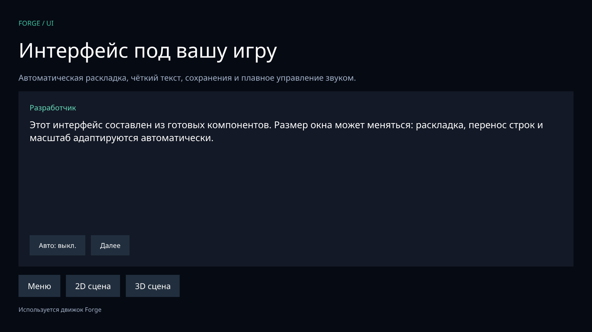

# Forge

Модульный игровой runtime: C++17, Python 3.10+, GLFW/OpenGL 3.3, macOS и Windows.

```sh
python3 tools/dependencies.py
python3 -m pip install cmake==3.31.6
python3 tools/forge.py compile
python3 tools/forge.py dev
python3 tools/forge.py build --output dist/MyGame
```

На Windows используйте `python` вместо `python3` и установите Visual Studio 2022 Build Tools с компонентом Desktop development with C++.

В этой рабочей папке движок уже собран. Можно сразу запустить:

```sh
./build/bin/forge dev
```

A/D — движение; Space — прыжок; Enter — текст новеллы; F5 — сохранение и звук; 2 — 3D; **3 — новый UI с меню, журналом и слотами**; 1 — возврат в 2D; Escape — выход.

[Подробная инструкция](Инструкция.md) · [Конфигурация](engine.json) · [Лицензия Forge](LICENSE) · [Атрибуция](ATTRIBUTION.md) · [Лицензии зависимостей](THIRD_PARTY.md)

Ядро не требует изменений при создании игры. Все папки контента задаются в JSON. Python API: `import forge`. Собранная игра содержит собственный Python runtime.

В Forge 1.1 есть готовые `Canvas`, `Row/Column`, кнопки, ползунки, прокрутка и перенос текста. Крупный текст учитывает HiDPI. Независимые модули предоставляют диалог/авточтение, журнал, меню паузы, сохраняемые настройки звука, слоты с версиями/проверкой целостности/backup и автосохранение, аудиоканалы и crossfade. Обработчики объектов допускают вложенный spawn; неудачный hot reload возвращает управляемое состояние движка.



Это рабочий исходный движок с указанными в инструкции возможностями; визуального редактора и уровня функциональности Unity/Unreal в нём нет. Ограничения описаны явно.

## Лицензия и изменения

Forge распространяется по пользовательской **Forge Attribution License 1.0** с открытым исходным кодом и обязательным указанием движка на загрузочном экране и в меню игры. Для собственного изменённого ядра нужна подпись «Создано на основе движка Forge (ядро изменено)»; для обычного ядра — «Используется движок Forge». Коммерческие и закрытые игры разрешены.

Всё вне [перечня файлов ядра](CORE.md) можно изменять для своей игры, если отдельная лицензия не устанавливает другие условия. Это включает шейдеры, физику, графические и звуковые модули. Лицензии сторонних компонентов сохраняются.

Лицензия пользовательская и не имеет статуса OSI-approved. Полные условия: [LICENSE](LICENSE).
